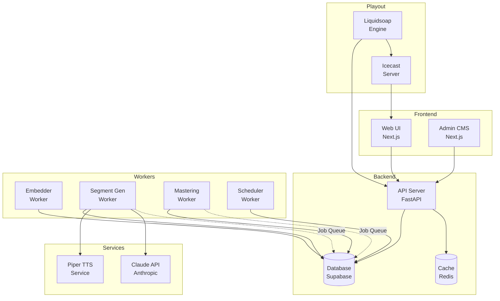
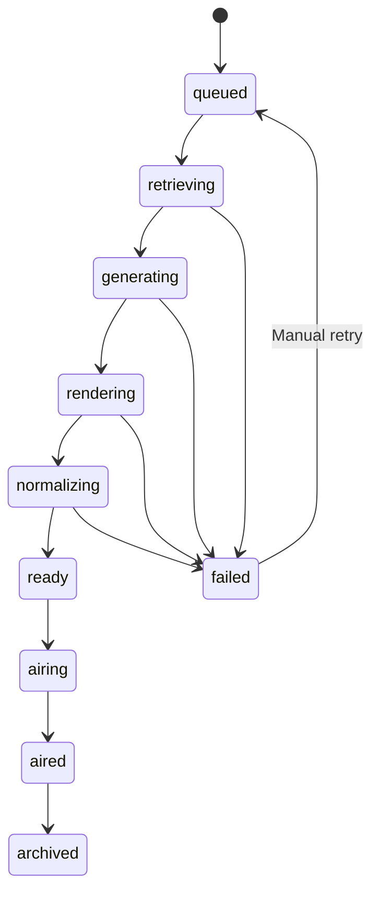
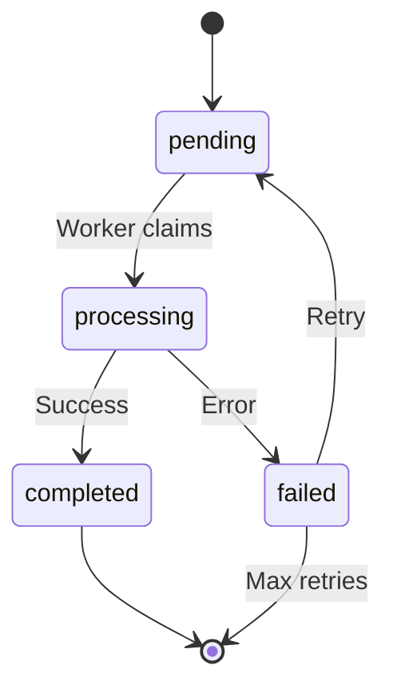
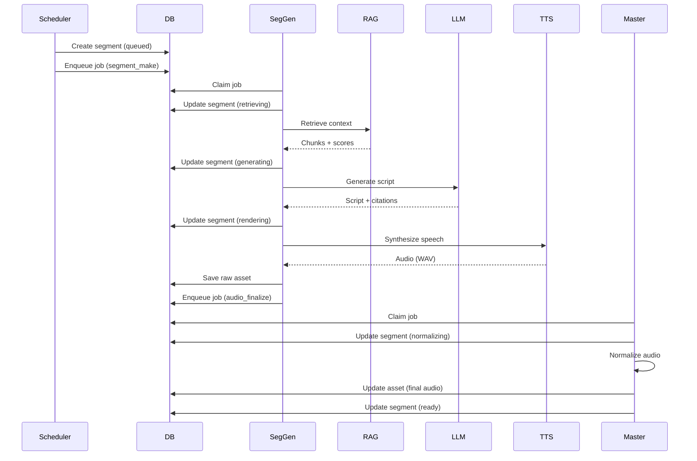
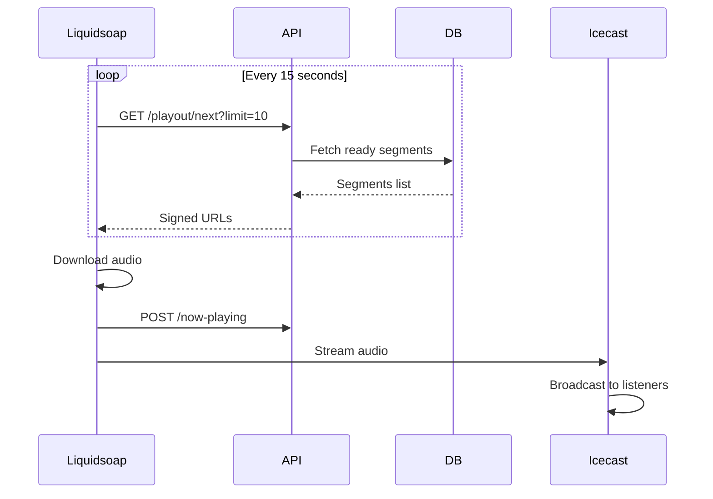

# AI Radio 2525 - Architecture Reference

**Version:** 1.0  
**Last Updated:** 2025-01-01

This document is a distilled reference extracted from the full specification.  
Maximum length: 5 pages when printed.

---

## Table of Contents

1. [System Map](#1-system-map)
2. [Monorepo Structure](#2-monorepo-structure)
3. [Data Model](#3-data-model)
4. [Component Contracts](#4-component-contracts)
5. [State Machines](#5-state-machines)
6. [Data Flows](#6-data-flows)
7. [Integration Points](#7-integration-points)
8. [Configuration](#8-configuration)

---

## 1. System Map


**Legend:**
- Solid lines: Data flow
- Dashed lines: Job queue communication
- Boxes: Components
- Cylinders: Storage

---

## 2. Monorepo Structure

| Path | Purpose | Dependencies |
|------|---------|--------------|
| `packages/radio-core` | Shared types, schemas, utilities | zod, pino |
| `packages/radio-test-utils` | Test factories and helpers | @radio/core, faker |
| `apps/web` | Public player UI | Next.js, @radio/core |
| `apps/api` | REST API, RAG orchestration | FastAPI, @radio/core |
| `workers/embedder` | KB indexing worker | @radio/core |
| `workers/segment-gen` | Content generation worker | @radio/core |
| `workers/mastering` | Audio processing worker | FFmpeg, @radio/core |
| `workers/scheduler` | Schedule generator worker | @radio/core |
| `ops/` | Quality gates, scripts | bash |
| `.claude/` | Standards, architecture docs | - |

---

## 3. Data Model

### Core Tables

| Table | Key Fields | State Machine |
|-------|-----------|---------------|
| `segments` | id, program_id, state, asset_id | Yes (10 states) |
| `jobs` | id, job_type, state, priority | Yes (4 states) |
| `universe_docs` | id, title, body, lang | No |
| `events` | id, title, event_date, importance | No |
| `assets` | id, storage_path, lufs_integrated | No |
| `djs` | id, name, voice_id | No |
| `programs` | id, name, dj_id, format_clock_id | No |
| `kb_chunks` | id, source_id, chunk_text | No |
| `kb_embeddings` | id, chunk_id, embedding | No |

**Full schemas:** See `@radio/core/schemas`

---

## 4. Component Contracts

### API Server

**Location:** `apps/api`  
**Port:** 8000  
**Entry:** `src/main.py`

**Key Endpoints:**
```typescript
// Playout
GET  /playout/next?limit=10  → { segments: Segment[] }
POST /now-playing            → { segment_id, title, timestamp }

// RAG
POST /rag/retrieve           → RAGResult

// Admin
POST /admin/segments         → Segment
GET  /admin/health           → HealthStatus
```

**Environment:**
- `SUPABASE_URL`
- `SUPABASE_SERVICE_ROLE_KEY`
- `REDIS_URL`
- `ANTHROPIC_API_KEY`

---

### Embedder Worker

**Location:** `workers/embedder`  
**Entry:** `src/index.ts`

**Input Contract:**
```typescript
type EmbedderJob = {
  job_type: 'kb_index';
  payload: {
    source_id: string;     // UUID
    source_type: 'universe_doc' | 'event';
  };
};
```

**Output:** Updates `kb_chunks`, `kb_embeddings`, `kb_index_status` tables

**Process:**
1. Fetch source document
2. Chunk text (300-800 tokens)
3. Generate embeddings (bge-m3)
4. Store in database

---

### Segment Generation Worker

**Location:** `workers/segment-gen`  
**Entry:** `src/index.ts`

**Input Contract:**
```typescript
type SegmentGenJob = {
  job_type: 'segment_make';
  payload: {
    segment_id: string;  // UUID
  };
};
```

**Output:** Updates `segments` table, creates `assets`

**Process:**
1. Retrieve RAG context (2s timeout)
2. Generate script (Claude Haiku)
3. Synthesize speech (Piper TTS)
4. Save raw audio
5. Enqueue mastering job

**Integration Points:**
- RAG Service: `POST /rag/retrieve`
- Piper TTS: `POST /synthesize`
- Claude API: via Anthropic SDK

---

### Mastering Worker

**Location:** `workers/mastering`  
**Entry:** `src/index.ts`

**Input Contract:**
```typescript
type MasteringJob = {
  job_type: 'audio_finalize';
  payload: {
    segment_id: string;
    asset_id: string;
    content_type: 'speech' | 'bed' | 'jingle';
  };
};
```

**Output:** Normalized audio in `assets` table

**Process:**
1. Load raw audio
2. Check for duplicate (content hash)
3. Normalize to target LUFS
4. Limit peaks
5. Validate quality
6. Upload final audio

**Tools:** FFmpeg

---

### Piper TTS Service

**Location:** Self-hosted HTTP service  
**Port:** 5002

**API Contract:**
```typescript
POST /synthesize
Body: {
  text: string;
  model: string;          // e.g., 'en_US-lessac-medium'
  speed: number;          // 0.5-2.0
  use_cache: boolean;
}

Response: {
  audio: string;          // Hex-encoded WAV
  duration_sec: number;
  model: string;
  cached: boolean;
}
```

---

### Liquidsoap Playout

**Location:** `apps/playout`  
**Entry:** `radio.liq`

**Integration:** Polls `/playout/next` every 15 seconds

**Outputs:**
- Icecast (Opus, 96kbps, port 8000)
- HLS (AAC, 128kbps, local filesystem)

---

## 5. State Machines

### Segment States


**Valid Transitions:**

| From | To | Trigger |
|------|--------|---------|
| queued | retrieving | Worker claims job |
| retrieving | generating | RAG complete |
| generating | rendering | LLM complete |
| rendering | normalizing | TTS complete |
| normalizing | ready | Mastering complete |
| ready | airing | Liquidsoap fetches |
| airing | aired | Segment finishes |
| aired | archived | Archive job |
| * | failed | Error occurs |
| failed | queued | Manual retry |

---

### Job States


---

## 6. Data Flows

### Flow 1: Content Generation


### Flow 2: Playout


---

## 7. Integration Points

| Service A | Method | Service B | Contract |
|-----------|--------|-----------|----------|
| Segment Gen | HTTP POST | RAG Service | `RAGQuery → RAGResult` |
| Segment Gen | HTTP POST | Piper TTS | `SynthesisRequest → Audio` |
| Segment Gen | SDK | Claude API | `Message → Response` |
| Liquidsoap | HTTP GET | API | `GET /playout/next` |
| API | SQL | Database | Supabase client |
| Workers | SQL | Database | Job queue (LISTEN/NOTIFY) |

---

## 8. Configuration

### Environment Variables

| Variable | Purpose | Default | Required |
|----------|---------|---------|----------|
| `SUPABASE_URL` | Database URL | - | Yes |
| `SUPABASE_SERVICE_ROLE_KEY` | DB admin key | - | Yes |
| `ANTHROPIC_API_KEY` | LLM API key | - | Yes |
| `PIPER_TTS_URL` | TTS service URL | http://localhost:5002 | Yes |
| `REDIS_URL` | Cache URL | redis://localhost:6379 | No |
| `FUTURE_YEAR_OFFSET` | Year offset for broadcast time | 500 | Yes |
| `RAG_TOP_K` | Retrieval results count | 12 | No |
| `RAG_TIMEOUT_MS` | Retrieval timeout | 2000 | No |
| `SPEECH_LUFS_TARGET` | Audio normalization target | -16 | No |

**Full list:** See `.env.example`

---

## Appendix A: Service Locations

| Service | Path | Port | Entry Point |
|---------|------|------|-------------|
| API | apps/api | 8000 | src/main.py |
| Web UI | apps/web | 3000 | pages/index.tsx |
| Embedder | workers/embedder | - | src/index.ts |
| Segment Gen | workers/segment-gen | - | src/index.ts |
| Mastering | workers/mastering | - | src/index.ts |
| Scheduler | workers/scheduler | - | src/index.ts |
| Piper TTS | External | 5002 | - |
| Liquidsoap | apps/playout | - | radio.liq |
| Icecast | External | 8000 | - |

---

## Appendix B: Integration Quick Reference

| If you need to... | Use this... | Located in... |
|-------------------|-------------|---------------|
| Validate a segment | `segmentSchema.parse()` | `@radio/core/schemas` |
| Log an event | `logger.info()` | `@radio/core/logger` |
| Retrieve RAG context | `POST /rag/retrieve` | `apps/api` |
| Generate speech | `POST /synthesize` | Piper TTS |
| Enqueue a job | `enqueueJob()` | Job queue service |
| Create test data | `createSegment()` | `@radio/test-utils` |

---

## Appendix C: Database Table Reference

| Table | Primary Key | Foreign Keys | State Column |
|-------|-------------|--------------|--------------|
| segments | id (uuid) | program_id, asset_id | state (enum) |
| jobs | id (uuid) | - | state (enum) |
| assets | id (uuid) | - | validation_status (enum) |
| programs | id (uuid) | dj_id, format_clock_id | - |
| djs | id (uuid) | voice_id | - |
| kb_chunks | id (uuid) | source_id | - |
| kb_embeddings | id (uuid) | chunk_id | - |
| kb_index_status | id (uuid) | source_id | state (enum) |

---

## Appendix D: Service Setup Guides

- Piper TTS Setup: See [.claude/PIPER_TTS_SETUP.md](.claude/PIPER_TTS_SETUP.md)